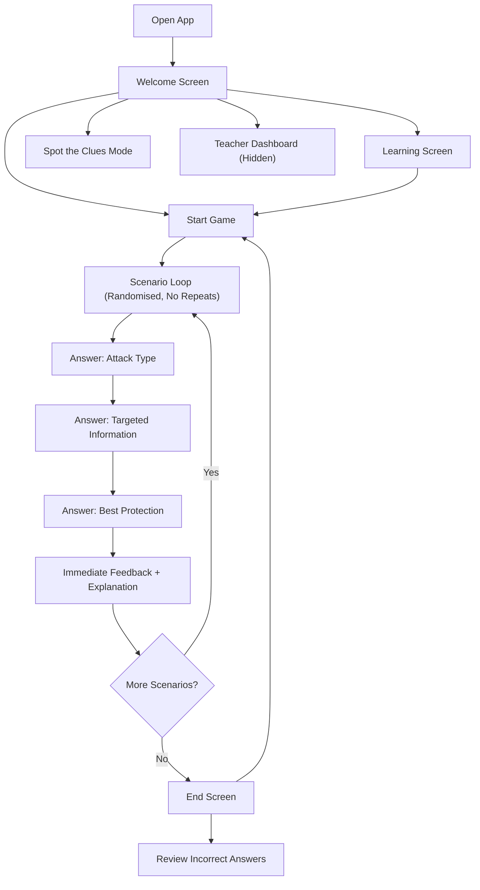

## 1. Product Overview
Social Engineering Detective is a self-contained browser game for GCSE Computer Science students (AQA 8525) to practise recognising social engineering attacks and selecting appropriate protections.
- Purpose: build accurate identification skills through short realistic teen-focused scenarios with instant feedback
- Value: supports AQA 3.6.2.1 Social engineering knowledge and exam-style reasoning (identify + explain + prevent)

## 2. Core Features

### 2.1 User Roles
| Role | Access Method | Core Permissions |
|------|---------------|------------------|
| Student | Open in browser | Play game, learn content, review mistakes, play bonus mode |
| Teacher | Hidden access | View dashboard with coverage and objectives mapping |

### 2.2 Feature Modules
1. **Welcome**: title, brief instructions, start learning, start game, spot-the-clues, restart
2. **Learning**: definitions and key points (Social engineering, Phishing, Blagging/Pretexting, Shoulder surfing) + prevention
3. **Core Game**: randomised scenarios, 3-step answers, immediate feedback, scoring, progress, sound effects
4. **End & Review**: final score, percentage, rating, review incorrect answers with explanations
5. **Teacher Dashboard**: hidden entry, display question counts, categories, AQA mapping, learning objectives
6. **Bonus "Spot the Clues"**: interactive phishing email mockup built in HTML/CSS; click suspicious elements for bonus points

### 2.3 Page Details
| Page Name | Module Name | Feature description |
|-----------|-------------|---------------------|
| Welcome | Mode chooser | Buttons: Learn, Start Game, Spot the Clues; shows short premise and what students will practise |
| Learning | Knowledge cards | Short, exam-ready definitions + prevention; quick check mini prompts (non-scored) |
| Game | Scenario viewer | Presents one scenario at a time; student answers: (1) attack type, (2) targeted information, (3) best protection |
| Game | Feedback panel | Animated correct/incorrect feedback; explanation; next button |
| Game | HUD | Score, question counter, progress bar, category chip |
| End | Results | Final score, percentage, performance rating; restart; review incorrect answers |
| End | Review | Accordion-style list of missed questions: student choice vs correct + explanation |
| Teacher | Dashboard modal | Number of questions, categories covered, AQA mapping, learning objectives achieved |
| Bonus | Clues mode | Realistic phishing email UI; click suspicious elements; track found clues; bonus points |

## 3. Core Process
Students can learn first, then play, then review. Teacher can view coverage at any time.

## 4. User Interface Design

### 4.1 Design Style
- Theme: modern cyber-security (dark UI, scanlines/noise, neon accents, terminal-like panels)
- Primary colors: deep near-black background; accents in cyan/green and warning red/amber
- Buttons: large, high-contrast, rounded rectangles; strong hover/press states for tablet use
- Typography: bold display for headings; readable mono-inspired body (system-safe stack)
- Layout: centered card panels with HUD bar; responsive grid for answers; touch-friendly spacing
- Motion: subtle ambient background animation; punchy correct/incorrect feedback animations

### 4.2 Page Design Overview
| Page Name | Module Name | UI Elements |
|-----------|-------------|-------------|
| Welcome | Hero | Title, subtitle, mode buttons, small “case file” intro block |
| Learning | Cards | 4 topic cards, each with definition + “How to prevent” bullets |
| Game | HUD | Progress bar, score, question number, category badge |
| Game | Answer steps | Three stepper sections; large buttons; selected state; locked after submit |
| End | Results | Big score ring, percentage, rating label, restart + review |
| Bonus | Email mock | Faux email client header, sender details, body content, buttons/links; clickable clues |
| Teacher | Dashboard | Modal with coverage summary and specification mapping |

### 4.3 Responsiveness
- Desktop-first but tablet-optimised (large tap targets, 2-column answer grids where space allows)
- Scales down to smaller screens with single-column answers and sticky “Next” action area
- Motion respects reduced-motion preference

## AQA Mapping (AQA 8525, 3.6.2.1 Social Engineering)
- Define social engineering as manipulation of people to obtain confidential information
- Recognise and explain phishing, blagging/pretexting, shoulder surfing
- Describe prevention methods: verification, strong passwords/MFA, privacy filters, awareness, secure processes
