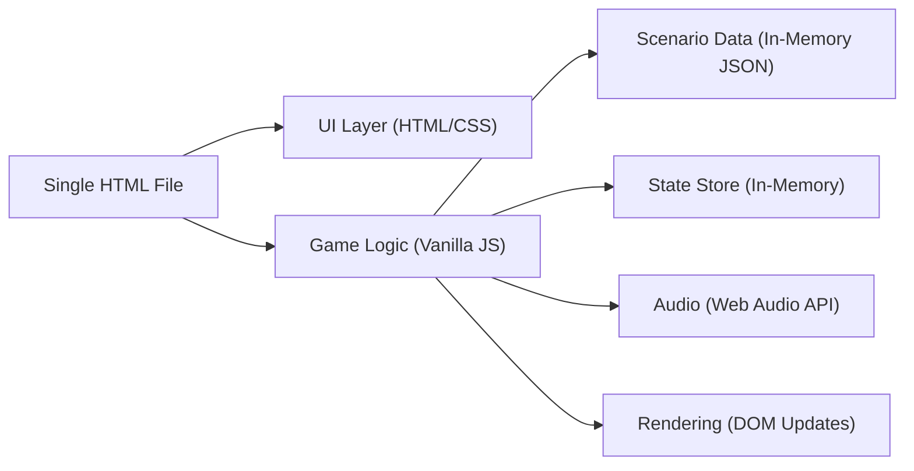

## 1. Architecture Design



## 2. Technology Description
- Frontend: Vanilla HTML + CSS + JavaScript (ES2020)
- Dependencies: None (no external libraries, frameworks, or network access)
- Audio: Web Audio API (oscillator + gain envelopes) for correct/incorrect/bonus sounds
- Storage: In-memory for a playthrough (optionally can add localStorage later, but not required)

## 3. Route Definitions
Single-page application with view switching (no URL routing required).

| View Key | Purpose |
|---------|---------|
| welcome | Entry screen, mode selection, hidden Teacher Dashboard trigger |
| learn | Learning content aligned to AQA 3.6.2.1 |
| game | Main quiz flow with 3-step answering per scenario |
| bonus | Spot-the-Clues phishing email interaction |
| end | Results + rating + review of incorrect answers |

## 4. Data Model

### 4.1 Scenario Object
Each scenario is a plain object in an in-memory array.

```js
{
  id: "phish-01",
  category: "phishing" | "blagging" | "shoulder_surfing" | "decoy",
  title: "Short label for HUD",
  story: "Teen-realistic message/story shown to student",
  correctAttackType: "Phishing" | "Blagging (Pretexting)" | "Shoulder Surfing" | "Not Social Engineering",
  targetedInfoOptions: ["Password", "Bank details", "Personal data", "Verification code", ...],
  correctTargetedInfo: "Password",
  protectionOptions: ["Enable MFA", "Verify identity via official channel", "Cover screen", ...],
  correctProtection: "Enable MFA",
  explanation: "Why this is the correct classification and how to prevent it"
}
```

### 4.2 Runtime State

```js
{
  mode: "learn" | "game" | "bonus" | "end",
  deck: ["scenarioId1", "scenarioId2", ...], // shuffled, no repeats
  index: 0,
  score: 0,
  answers: {
    [scenarioId]: {
      chosenAttackType: string,
      chosenTargetedInfo: string,
      chosenProtection: string,
      correct: boolean
    }
  },
  missed: ["scenarioId", ...],
  bonus: {
    foundClues: Set<string>,
    awarded: boolean
  }
}
```

## 5. UI/Logic Structure (Single File)
- HTML: semantic containers per screen (section elements), one visible at a time
- CSS: design tokens via :root variables; responsive layout via flex/grid; animations for feedback
- JS Modules (in-file): data, state, shuffle/deck, render functions, event handlers, audio, teacher dashboard builder

## 6. Key Algorithms
- Shuffle: Fisher–Yates shuffle to randomise scenario order
- No-repeat: deck built from selected scenario IDs once per game; each asked exactly once
- Scoring: points per correct step (attack type + target info + protection); bonus points for Spot-the-Clues completion
- Review: end screen renders missed scenarios with correct answers and explanations

## 7. Accessibility & UX
- Large buttons and clear focus states
- ARIA live region for feedback announcements
- Reduced motion support (prefers-reduced-motion)
- Keyboard support (tab + enter/space) alongside touch
